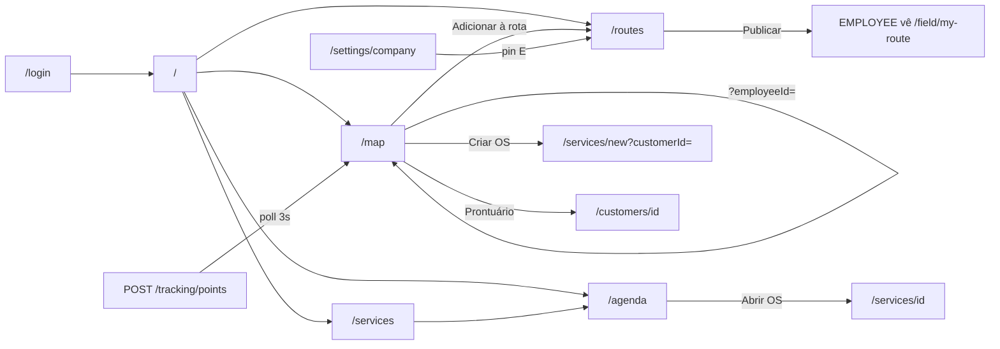
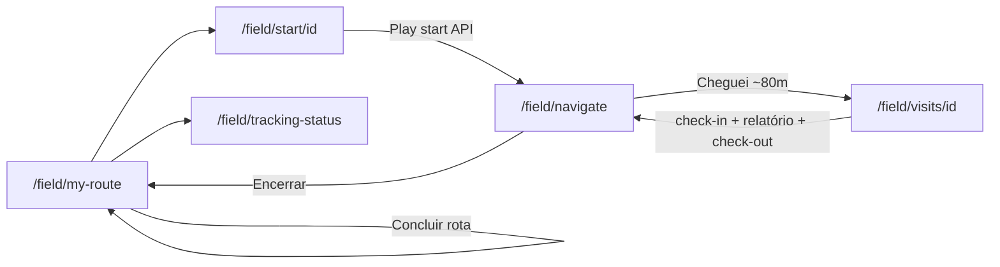

# PRD Design Handoff — Rotas (wireframes, fluxos e cores)

| Campo | Valor |
| --- | --- |
| Produto | **Rotas** (repo SAMUEL) — operações externas, rotas e visitas |
| Software | v0.14.1 |
| Data deste handoff | 02/09/2026 |
| Escopo | **Somente telas que existem no código** |
| Fonte de produto | [`PRD.md`](../PRD.md) |
| Fonte de UX funcional | [`PRD-UX-FUNCIONAL.md`](PRD-UX-FUNCIONAL.md) + [`screens/`](screens/) |
| Código UI | `apps/web/` (Next.js 15 + Tailwind + MapLibre) |

Este arquivo é **autocontido** para copiar e colar em outra IA. Não substitui o PRD de produto nem o PRD UX funcional. É o recorte **visual**: layout espacial, cores por bloco, como as telas se ligam.

**v0.14:** home/mapa/planejador reorganizados como centro de comando (experiência operacional). KPI ausente na API → `—`.

---

## 0. Prompt para a IA receptora (cole junto com este documento)

```
Você é um diretor de design / UX sênior. Analise o dossiê abaixo do produto "Rotas"
(gestão de operações externas: mapa, OS, rotas, PWA de campo).

TAREFA
1. Audite hierarquia visual, densidade, consistência de tokens, contraste e ritmo.
2. Separe claramente os DOIS mundos: gestor (claro) vs campo tela cheia (escuro).
3. Priorize melhorias por impacto (home, mapa, planejador, navegação GPS, check-in).
4. Para cada melhoria: problema → recomendação concreta → tokens/cores sugeridos →
   risco de regressão. Use wireframes ASCII se ajudar.
5. Mobile ~375px e PWA de campo importam tanto quanto desktop gestor.

REGRAS ABSOLUTAS
- NÃO invente telas, rotas, KPIs, filtros ou fluxos que não estejam neste dossiê.
- NÃO mude regras de negócio (RBAC, check-in/check-out, Encerrar ≠ Concluir, etc.).
- NÃO misture Presence (online Redis), Operational (IN_ROUTE/IN_SERVICE…) e status RH
  do Employee (ACTIVE/INACTIVE…).
- KPI sem dado na API = não renderizar ou "—" — nunca placeholder inventado.
- Home/mapa/planejador = experiência operacional (3s), não lista de componentes.
- Não unifique visualmente o campo escuro com o admin claro só por "consistência".
- Responda em português. Entregue: (A) diagnóstico geral, (B) top 10 melhorias
  ordenadas, (C) especificação por tela crítica, (D) o que NÃO mexer.
```

---

## 1. Um mundo visual

| Mundo | Onde | Sensação | Fundo | Chrome |
| --- | --- | --- | --- | --- |
| **Operação (gestor e campo)** | Auth + shell `(app)` + `/field/*` | Console B2B escuro, denso | `#121212` | Sidebar + header |
| **Campo tela cheia** | `/field/navigate`, `/field/visits/[id]` | Mesmo canvas + mapa Dark Matter + HUD | `#121212` | Sem sidebar/header |

Tipografia: **Overpass** (tudo). Theme PWA: `#121212`. Acento de interação: `#FF5722`. Menta `#2EE6C7` **somente** polyline/glow de rota.

---

## 2. Tokens e paleta (código real)

### 2.1 CSS variables — `apps/web/src/app/globals.css`

| Token | Hex | Uso |
| --- | --- | --- |
| `--bg` / `--background` | `#121212` | canvas |
| `--surface` | `#1C1C1E` | placas, cards, tabelas |
| `--ink` | `#F2F2F4` | texto |
| `--muted` | `#9A9AA0` | hint, labels |
| `--brand` / `--accent` | `#FF5722` | CTA, ativo, foco |
| `--danger` | `#E5484D` | erro / destrutivo |
| `--ok` | `#3DDC84` | sucesso semântico (não é polyline) |
| `--warn` | `#F5A524` | atraso / HTTPS |
| `--route` | `#2EE6C7` | **só** traçado no mapa |

### 2.2 Tailwind `brand` — `apps/web/tailwind.config.js`

| Classe | Hex | Uso típico |
| --- | --- | --- |
| `brand-50` | `#242426` | hover / chip |
| `brand-100` | `#2C2C2E` | borda |
| `brand-500` / `600` | `#FF5722` | CTA, tab ativa |
| `brand-700` | `#E64A19` | hover CTA |
| `brand-800` | `#C8C8CA` | texto secundário |
| `brand-900` | `#F2F2F4` | títulos |

### 2.3 Semânticos de UI

| Papel | Token | Onde |
| --- | --- | --- |
| Erro | `--danger` / `--danger-bg` | FormError, alertas |
| Sucesso | `--ok` / `--ok-bg` | senha alterada, forgot |
| Presença ao vivo | `bg-emerald-500` | ponto Equipe (Presence ≠ Operational) |
| Offline | `bg-brand-200` | ponto |
| Linha rota | `#2EE6C7` glow + line | MapLibre navigate e gestor |
| Trilha de acesso | `#2EE6C7` tracejada | pin do cliente no mapa |
| Preview straight | `--warn` | linha reta no planejador |
| Overlay menu | `bg-black/40` | drawer mobile |

### 2.4 Componentes compartilhados

| Componente | Superfície |
| --- | --- |
| `AuthCard` | `ops-surface`; marca “Rotas” em tracking + acento |
| `SubmitButton` | `ops-btn-primary` (`#FF5722`) |
| `PageHeader` H1 | Overpass semibold `text-brand-900` |
| `FormCard` / `FormSection` | superfície + grupos semânticos |
| Input | `.ops-input` inset `#161618` |
| `DataTable` | densidade operacional, hover discreto |
| `AppHeader` / sidebar | mesmo canvas `#121212`; ativo laranja |

---

## 3. Fluxos — como as telas se comunicam

### 3.1 Gestor (planejar → publicar)



### 3.2 Campo (executar → check-in → finalizar)



**Regra visual/UX crítica:** **Encerrar** na navegação **não** conclui a rota. Só **Concluir rota** em Minha rota marca `COMPLETED`.

### 3.3 Matriz de contexto (dado que atravessa)

| De | Para | O que atravessa |
| --- | --- | --- |
| `/login` | `/` ou `?next=` | cookies JWT |
| `/forgot-password` | `/reset-password?token=` | token (log API em dev) |
| `/account/change-password` | `/login?changed=1` | sessões revogadas + banner |
| `/settings/company` | `/routes` | pin origem **E** |
| `/map` pin | `/services/new?customerId=` | cliente |
| `/map` pin | `/customers/[id]` | prontuário |
| `/map` pin | `/routes?customerId=` | pré-seleção |
| `/employees/[id]` | `/map?employeeId=` | foco drawer |
| `/routes` publicar | `/field/my-route` | rotas `PUBLISHED` |
| `/field/my-route` | `/field/start/[id]` | rota do dia |
| `/field/start/[id]` | `/field/navigate` | start + veículo + GPS |
| `/field/navigate` | `/field/visits/[id]` | visita da parada |
| GPS campo | `/map` | live tracking |

### 3.4 Papéis (o que cada um *vê*)

| Área | ADMIN | MANAGER | SUPERVISOR | EMPLOYEE |
| --- | --- | --- | --- | --- |
| Snapshot home | sim | sim | sim | capa atalhos |
| Mapa | sim | sim | sim (sem criar OS) | não |
| Rotas publicar | sim | sim | preview só | não |
| Campo `/field/*` | não (nav) | não | não | sim |
| Empresa / Usuários | sim | não | não | não |

---

## 4. Chrome compartilhado (não é rota)

**Rotas:** todas autenticadas **exceto** `/field/navigate` e `/field/visits/[id]` (layout `(field-nav)`).

### Wireframe desktop (lg+)

```
+--------+------------------------------------------+
| SIDEBAR| HEADER: [Rotas]              [UserMenu]  |
| w-56   | border-brand-100 bg-white/90 blur        |
| white/ |------------------------------------------|
| 80     | MAIN                                     |
|        |  full-bleed se / ou /map                 |
| Rotas  |  senão max-w-5xl + padding               |
| empresa|                                          |
| ------ |                                          |
| OPERAÇÃO                                          |
|  Início (ativo=brand-600 branco)                  |
|  Mapa / Agenda / Serviços / Rotas / Campo*        |
| RECURSOS                                          |
|  Clientes / Funcionários* / Veículos*             |
| ADMIN*                                            |
|  Empresa / Usuários                               |
+--------+------------------------------------------+
* conforme papel
```

### Wireframe mobile

```
+----------------------------------+
| [☰] Rotas              UserMenu  |
+----------------------------------+
| MAIN (full width)                |
|                                  |
+----------------------------------+
Drawer: overlay black/40 + aside w-64 white
```

### Cores do chrome

| Bloco | Cor |
| --- | --- |
| Sidebar fundo | `bg-white/80` |
| Borda | `border-brand-100` `#d5ebe3` |
| Marca | `text-brand-700` Fraunces |
| Grupo | `text-brand-500` 10px uppercase |
| Item ativo | `bg-brand-600 text-white` |
| Item idle | `text-brand-800 hover:bg-brand-50` |
| Header | `bg-white/90 backdrop-blur` |
| Botão ☰ | `border-brand-100 text-brand-800` |
| Overlay | `bg-black/40` |

---

## 5. Wireframe-base CRUD (listas + forms)

Usado por: Clientes, Funcionários, Veículos, Serviços (lista), Usuários.

### Lista

```
PageHeader (H1 brand-900 + CTA Novo brand-600)
OperationalSummaryStrip (grid KPI cards)     [se ops]
[busca / filtros] border-brand-100 bg-white
DataTable: thead brand-50/80 | rows brand-900
empty: dashed border-brand-200 bg-white/60 muted
```

### Form

```
PageHeader
[EntityContextPanel]                         [se detalhe ops]
FormCard white/90 border-brand-100
  labels brand-900
  inputs ring-brand-500
  SubmitButton brand-600 full
```

### Cores base

| Bloco | Hex / token |
| --- | --- |
| Página | fundo body |
| Card / tabela | `white/90` + `brand-100` |
| CTA primário | `#185a49` |
| Erro | `red-50` / `red-700` |
| Empty | dashed `brand-200`, texto `--muted` |

---

## 6. Autenticação

### 6.1 Login — `/login`

**Faz:** autenticar; redirect `/` ou `?next=`. Banner se `?changed=1`.

```
          [fundo gradiente claro]
     +---------------------------+
     |      Rotas (brand-700)    |
     |      Entrar (brand-900)   |
     |   subtítulo muted         |
     | +-----------------------+ |
     | | card white/90         | |
     | | [banner changed?]     | |
     | | E-mail                | |
     | | Senha                 | |
     | | [erro red]            | |
     | | [ Entrar brand-600 ]  | |
     | | Esqueci minha senha   | |
     | +-----------------------+ |
     | rodapé muted              |
     +---------------------------+
        max-w ~400px
```

| Bloco | Cor |
| --- | --- |
| Marca | `#124537` |
| Card | `white/90` + borda `#d5ebe3` |
| CTA | `#185a49` branco |
| Erro | vermelho Tailwind |
| Banner sucesso senha | texto/alerta ok |

**Navega:** → `/` · → `/forgot-password`

### 6.2 Esqueci senha — `/forgot-password`

Mesmo AuthCard. Sucesso: alerta verde `role=status` + Voltar ao login.

### 6.3 Redefinir senha — `/reset-password?token=`

AuthCard. Nova + Confirmar. Sem token: erro + Voltar.

### 6.4 Alterar senha — `/account/change-password`

Dentro do chrome. Form `max-w-md`. Sucesso → `/login?changed=1`.

---

## 7. Operação

### 7.1 Centro de Operações — `/` (gestor)

**Papéis:** ADMIN, MANAGER, SUPERVISOR.  
**Faz:** estado do negócio em ~3 segundos — faixa EQUIPE / VISITAS / ROTAS / AO VIVO + execução + alertas + live + próximas visitas + rotas do dia.

```
[chrome]
H1 Centro de Operações     [Dia date]
+--------+--------+--------+--------+
| EQUIPE | VISITAS| ROTAS  | AO VIVO|  hero + linhas reais da API
+--------+--------+--------+--------+
| EXECUÇÃO (barra % ou —)  | ALERTAS |
+--------------------------+--------+
| EQUIPE AO VIVO           | PRÓXIMAS VISITAS |
+--------------------------+--------+
| ROTAS DO DIA (Rota 01 · func · N paradas · Concluídas — · status) |
+-----------------------------------+
empty dia: CTA → Rotas / Serviços
```

KPI só de `GET /ops/snapshot` + `/ops/routes/summary` + `/visits` + `/routes`. Ausente → —.

| Bloco | Cor |
| --- | --- |
| MetricHero | `white/90 border-brand-100 rounded-2xl` |
| Label | `brand-500` 10px uppercase |
| Valor | Fraunces `brand-900` |
| Loading | 4 skeletons |
| Erro | `role=alert` vermelho |

**Navega:** cards → `/map`, `/agenda`, `/routes`, `/employees`

### 7.2 Home EMPLOYEE — `/`

```
[chrome]
+---------------------------+
| Olá, {nome}  brand-900    |
| empresa · Campo  muted    |
+---------------------------+
| Minha rota | Agenda       |
| Clientes   |              |  cards white/90 hover border-brand-300
+---------------------------+
```

Sem snapshot da empresa.

### 7.3 Mapa — `/map` (desktop)

**Papéis:** ADMIN, MANAGER, SUPERVISOR.  
**Faz:** centro de comando — camadas Clientes/Equipe/Rotas/Todos + trilho direito.

```
[chrome full-bleed]
+--------------------------------------------------+
| Busca | Status | Data | Equipe | Filtrar | camadas | Ao vivo N |
+-------------------------------+------------------+
| MAPA MapLibre                 | Trilho ~300px    |
|  pins / carros / LineString   | EQUIPE lista     |
|  conforme camada              | ou DETALHE       |
|                               | func / cliente   |
+-------------------------------+------------------+
Mobile: mapa · abas Equipe | Detalhe · ☰ drawer
```

Detalhe funcionário: operacional ≠ presença; rota; veículo; paradas; Ver rota / Ver funcionário.  
Detalhe cliente: context card; categoria —; ações API.

| Bloco | Cor |
| --- | --- |
| Fundo área | `bg-brand-50/40` |
| Camada ativa | `bg-brand-600 text-white` |
| Badge Ao vivo | `emerald-50 / emerald-800` |
| Ponto online | `emerald-500` |
| Linha rota | `#0d9488` / `#0f766e` |

**Navega:** → `/services/new?customerId=` · `/customers/[id]` · `/routes?customerId=` · `/employees/[id]` · `?employeeId=`

### 7.4 Agenda — `/agenda`

```
PageHeader Agenda
SummaryStrip (planejadas / concluídas / …)
[Data] [Atualizar]
+---------------------------+
| HH:MM  STATUS             |
| OS # — título             |
| Cliente · Funcionário     |
| [Abrir OS] (não EMPLOYEE) |
+---------------------------+
```

Cards empilhados; empty muted; erro vermelho.

**Navega:** → `/services/[id]`

### 7.5 Serviços — `/services` · `/new` · `/[id]`

**Lista:** wireframe-base + colunas #, Título, Cliente, Status, Prioridade, Visitas, Abrir.  
**Novo:** FormCard Cliente*, Título*, Descrição, Prioridade, Prazo, 1ª visita. `?customerId=` pré-seleciona.  
**Detalhe:** dados + Cancelar + lista visitas + form Adicionar visita + context panel.

**Navega:** lista ↔ new ↔ detalhe · cliente → `/customers/[id]` · visitas → agenda/rotas

### 7.6 Rotas — `/routes`

**Abas:** Rotas de hoje | Planejador (Clientes | Visitas).

#### Aba Hoje

```
SummaryStrip
Rota 01 — João · Em andamento · N paradas · Concluídas — · km
```

#### Planejador modo Clientes

```
PLANEJADOR [Data] [roundtrip] [funcs] [busca]
RESUMO: N funcs · N paradas · km · duração · N rotas
ROTA 01 — JOÃO
  E → 1 → 2 → 3 → E
[Publicar] brand-600
+-------------+------------------+
| Lista ordem | Mapa preview     |
| E (verde)   | azul road /      |
| 1,2,3…      | âmbar reta       |
+-------------+------------------+
```

| Bloco | Cor |
| --- | --- |
| Marcador **E** | verde empresa |
| Preview road | `#1d4ed8` |
| Straight-line aviso | `#d97706` / amber |

**Navega:** publicar → campo EMPLOYEE; sem pin → aviso + link Empresa.

---

## 8. Recursos

### 8.1 Clientes — `/customers` · `/new` · `/[id]`

**Lista:** summary (total, ativos, pin, visita hoje, OS, sem 30d) + tabela enriquecida.  
**Form:** dados + CEP/CNPJ lookup + **mapa pin obrigatório** (alto: ~360px mobile / ~56vh desktop) + categoria/prioridade/status.  
Hints lookup: texto **amber**. Sem pin: FormError.

**Navega:** → mapa (pin) · context → OS / rota / histórico.

### 8.2 Funcionários — `/employees` · `/new` · `/[id]`

**Lista:** Nome, Cargo, Status RH, Operacional, Rota hoje, Acesso (Com/Sem login).  
**Novo:** cria Employee + User EMPLOYEE (e-mail+senha).  
**Edit:** perfil + bloco Acesso; ADMIN link reset → `/settings/users/:userId`.  
**Detalhe ops:** EntityContextPanel + “Ver no mapa” → `/map?employeeId=`.

**Atenção design:** Status RH ≠ Presence ≠ Operational — não unificar visualmente como se fossem um só.

### 8.3 Veículos — `/vehicles` · `/new` · `/[id]`

**Lista:** Placa, Modelo, Status, Rota hoje, Motorista.  
**Form:** placa*, marca/modelo, combustível, consumo, status AVAILABLE/IN_USE/MAINTENANCE/INACTIVE.

---

## 9. Administração

### 9.1 Empresa — `/settings/company` (ADMIN)

Form + mapa pin **opcional** (origem **E** das rotas). Sucesso: “Salvo com sucesso.”

### 9.2 Usuários — `/settings/users` · `/new` · `/[id]` (ADMIN)

Lista Nome/E-mail/Perfil/Status. Novo: nome, e-mail, perfil, senha. Edit: dois FormCards (dados + redefinir senha).

---

## 10. Execução (campo)

### 10.0 Overlay PWA + GPS — `FieldPwaLocationGate`

Não é rota. Cobre `/field/my-route`, start, tracking-status (e fluxo HTTPS).

```
+----------------------------------+
| dialog fullscreen                |
| título: Instale / Ative GPS      |
| texto                            |
| [ CTA único brand ]              |
+----------------------------------+
HTTP LAN: faixa "NÃO ESTÁ EM HTTPS" (âmbar/alerta) — não bloqueia
```

### 10.1 Minha rota — `/field/my-route`

```
[chrome + gate]
H1 Minha rota     KPI dia     [Status GPS]
[card Tracking HTTP se IN_PROGRESS]
+---------------------------+
| Rota N · Publicada/Em and.|
| veículo · km · tempo      |
| [▶ Iniciar] ou Continuar  |
| [Concluir] se IN_PROGRESS |
| paradas listadas          |
+---------------------------+
leftover outro dia: faixa amber
```

| Bloco | Cor |
| --- | --- |
| Cards | mundo claro (brand) |
| Erro | vermelho alert |
| Leftover | âmbar |
| CTA Play | brand |

**Navega:** → start · navigate · tracking-status · agenda (empty)

### 10.2 Iniciar rota — `/field/start/[id]`

Wizard 5 passos: gps → summary → vehicle → checklist → confirm. Mini-mapa ~200px. CTA final ▶ → navigate.

### 10.3 Navegação GPS — `/field/navigate` (tela cheia escura)

```
+----------------------------------+
| MAPA escuro CARTO                |
|  linha verde #86efac/#16a34a      |
|  só até parada-alvo              |
|  carro GPS + pins                |
| [banner instrução / Chegando]    |
|     brand / amber / red          |
|                    (Centralizar) |
| +--------+--------+--------+---+ |
| | tempo  | km     | ETA    |km/h|| HUD black/70
| +--------+--------+--------+---+ |
| [Encerrar]                       |
+----------------------------------+
```

| Bloco | Cor |
| --- | --- |
| Fundo | `#0b1411` |
| Linha | `#86efac` / `#16a34a` |
| Banner OK | `brand-700/95` branco |
| Banner chegando | amber |
| Banner erro/fora | `red-800/90` |
| Sem GPS | `amber-950/90` + CTA amber-400 |
| Pin atual | `amber-400` |
| Pin futuro | `brand-500` |
| Modal Encerrar | branco `brand-900` texto |
| Follow on | `teal-600/80` |

**Navega:** Encerrar → my-route (rota segue IN_PROGRESS) · Cheguei → `/field/visits/[id]`

### 10.4 Visita / check-in — `/field/visits/[id]` (tela cheia escura)

**Faz:** check-in GPS → relatório (resultado, obs, fotos 1–5) → check-out → volta navigate.

```
fundo #0b1411 text-white
[← Voltar à navegação]
Cliente · OS · endereço · status
Fase 1: [Cheguei — chegada verificada] brand-500
Fase 2: banner teal sucesso
        radios resultado
        obs / fotos / remarcar
        [Finalizar visita]
```

| Bloco | Cor |
| --- | --- |
| Fundo | `#0b1411` |
| CTA | `brand-500` branco |
| Secundário | `border-white/30` |
| Banner pós check-in | `border-teal-400/40 bg-teal-950/60` |

### 10.5 Status GPS — `/field/tracking-status`

Card diagnóstico: Transporte HTTP, Sessão ativa/inativa, PWA vs aba, permissão GPS. Erro: borda vermelha. Link ← Minha rota.

---

## 11. Inventário completo (checklist para a IA)

| Rota | Mundo | Wireframe neste doc |
| --- | --- | --- |
| Chrome shell | claro | §4 |
| `/login` | claro auth | §6.1 |
| `/forgot-password` | claro auth | §6.2 |
| `/reset-password` | claro auth | §6.3 |
| `/account/change-password` | claro shell | §6.4 |
| `/` gestor | claro | §7.1 |
| `/` EMPLOYEE | claro | §7.2 |
| `/map` | claro full-bleed | §7.3 |
| `/agenda` | claro | §7.4 |
| `/services*` | claro CRUD | §7.5 + §5 |
| `/routes` | claro | §7.6 |
| `/customers*` | claro CRUD | §8.1 + §5 |
| `/employees*` | claro CRUD | §8.2 + §5 |
| `/vehicles*` | claro CRUD | §8.3 + §5 |
| `/settings/company` | claro | §9.1 |
| `/settings/users*` | claro | §9.2 |
| PWA gate | overlay | §10.0 |
| `/field/my-route` | claro + gate | §10.1 |
| `/field/start/[id]` | claro + gate | §10.2 |
| `/field/navigate` | **escuro** | §10.3 |
| `/field/visits/[id]` | **escuro** | §10.4 |
| `/field/tracking-status` | claro + gate | §10.5 |

**Não documentar como tela viva (ainda / fora):** UI auditoria `/settings/audit`, ranking/custos dashboard paralelo, WebSocket, app nativo, Chatwoot.

---

## 11b. Fase 2 — direção visual (ainda sem código nesta entrega)

Wireframes-alvo para próximas iterações (só dados já na API; sem inventar KPI):

1. `/services/[id]` — prontuário em camadas (cliente → descrição → visitas → rota → ações)
2. `/customers/[id]` — operação + OS + histórico (`GET /ops/customers/:id`)
3. Funcionário — RH ≠ Presence ≠ Operational explícitos
4. Veículo — placa / status / motorista / rota / consumo se existir — sem telemetria
5. `/field/my-route` — lista de paradas + Encerrar ≠ Concluir impossível de confundir
6. `/field/navigate` — **não enriquecer**
7. `/field/visits/[id]` — “o que falta para concluir”; outcomes DONE/NO_CONTACT/REFUSED/FOLLOW_UP

---

## 12. Critérios de qualidade (para a IA pontuar)

1. Hierarquia: o que o gestor vê em 3 segundos na home e no mapa?
2. Densidade: listas CRUD vs mapa full-bleed — ritmo coerente?
3. Dois mundos: campo escuro legível sob sol (contraste)? HUD legível?
4. Tokens: há hex soltos demais vs escala `brand`?
5. Estados: loading / empty / error / forbidden têm peso visual distinto sem gritar?
6. Mobile: drawer, abas do mapa, wizard start, navigate 100dvh + safe-area?
7. Acessibilidade: contraste brand-600 em branco; erros com `role=alert`; focus rings `brand-500`.
8. Consistência de CTAs: primary sempre `brand-600` no claro e `brand-500` no escuro — ok ou confuso?
9. Semântica de cor: emerald = presença; amber = atenção GPS; red = erro; teal = rota — está ensinado na UI?
10. Anti-CRUD: telas operacionais mostram KPI + contexto ou ainda parecem planilha?

---

## 13. Como usar este handoff

1. Copie **§0 (prompt) + o arquivo inteiro** para a outra IA.
2. Peça o entregável A–D do prompt.
3. Traga as recomendações de volta ao Cursor para implementar (sem inventar produto).
4. Comportamento canônico continua em `PRD.md` + `PRD-UX-FUNCIONAL.md` + `docs/screens/`.

---

*Fim do handoff. Nada neste arquivo inventa tela ou regra; descreve o que o código e as fichas em `docs/screens/` já fazem.*
